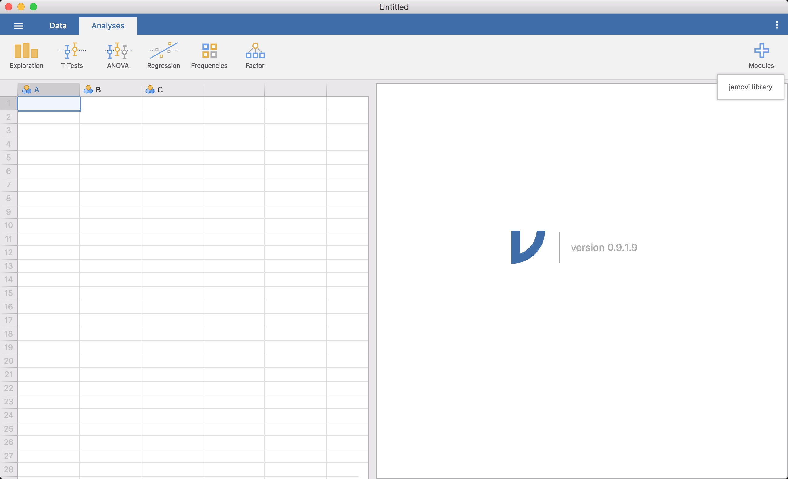

--- 
title: "Answering questions with data: Lab Manual"
author: 
- "Matthew J. C. Crump, Anjali Krishnan, Stephen Volz, and Alla Chavarga"
date: "2018: Last Compiled `r Sys.Date()`"
site: bookdown::bookdown_site
output: 
  bookdown::gitbook:
    includes:
      in_header: includeme.html
      before_body: testpic.html
    css: [tufte.css, style.css]
    fontsettings:
      theme: white
      family: sans
      size: 1
documentclass: book
bibliography: [book.bib, packages.bib, MyLibrary.bib]
biblio-style: apalike
link-citations: yes
#github-repo: rstudio/bookdown-demo
description: "A lab manual for Psyc 3400"
---

```{r setup, include=FALSE}
knitr::opts_chunk$set(message=FALSE,warning=FALSE, cache=TRUE)
```


# Preface {-}

```{r,eval=FALSE,echo=F,fig.align="center"}
knitr::include_graphics("LabmanualCover.png")
```

First Draft (version 0.9 = August 15th, 2018)
Last Compiled: `r Sys.Date()`

This is the companion lab to our free introductory statistics for undergraduates in psychology textbook, [Answering questions with data](https://crumplab.github.io/statistics/).

This lab manual involves step by-step tutorials to solve data-analysis problems in software. We use open-data sets that are usually paired with a primary research article.

Each lab has a separate guide for solving the problems in R & R-studio, Excel, SPSS, and JAMOVI.

The manual is a free and open resource. See below for more information about copying, making change, or contributing to the lab manual.

## Important notes

This lab manual is released under a creative commons licence [CC BY-SA 4.0](https://creativecommons.org/licenses/by-sa/4.0/). Click the link to read more about the license, or read more below in the license section.

This lab manual is part of a larger OER course package for teaching undergraduate statistics in Psychology. Team members include, Matthew Crump, Alla Chavarga, Anjali Krishnan, Jeffrey Suzuki, and Stephen Volz. As this OER comes together, we will be providing a [course website](https://crumplab.github.io/psyc3400/), written in R Markdown, as well as slide decks for the lectures (these will be more fully available by the end of fall 2018). As a result, this textbook, the lab manual, the course website, and the slide decks will all be free, under a creative commons license. The source code for all material is contained in the GitHub repositories for each, and they are a written in R-markdown, so they are relatively easy to copy and edit. Have Fun!

### Attributions

This lab manual was authored by Matt Crump (R exercises), Anjali Krishnan (JAMOVI exercises), Stephen Volz (EXCEL exercises), and Alla Chavarga (SPSS exercises).

Labs 6, 7, and 8 were adapted and expanded from [Open Stats Labs](https://sites.trinity.edu/osl). Thanks to Open Stats Labs (Dr. Kevin P. McIntyre) for their fantastic work.


### CC BY-SA 4.0 license

This license means that you are free to:

- Share: copy and redistribute the material in any medium or format
- Adapt: remix, transform, and build upon the material for any purpose, even commercially.

The licensor cannot revoke these freedoms as long as you follow the license terms.

Under the following terms:

- Attribution: You must give appropriate credit, provide a link to the license, and indicate if changes were made. You may do so in any reasonable manner, but not in any way that suggests the licensor endorses you or your use.
- ShareAlike: If you remix, transform, or build upon the material, you must distribute your contributions under the same license as the original.
- No additional restrictions: You may not apply legal terms or technological measures that legally restrict others from doing anything the license permits.

### Copying the lab manual

This lab manual was written in R-Studio, using R Markdown, and compiled into a web-book format using the bookdown package. 

All of the source code for compiling the book is available in the GitHub repository for this book:

[https://github.com/CrumpLab/statisticsLab](https://github.com/CrumpLab/statisticsLab)

In principle, anybody could fork or otherwise download this repository. Load the Rproj file in R-studio, and then compile the entire book. Then, the individual .rmd files for each chapter could be edited for content and style to better suit your needs.

If you want to contribute to this version of the lab manual, you could make pull requests on GitHub, or discuss issues and request on the issues tab.


### Acknowledgments

Thanks to the librarians at Brooklyn College of CUNY, especially Miriam Deutch, and Emily Fairey, for their support throughout the process. Thanks to CUNY for supporting OER development, and for the grant we received to develop this work.

# Software {-}

<script>
$("#coverpic").hide();
</script>

## Data

Data files used for the labs are all taken from open data sources. Links are provided for each lab. For convenience, all of the data files are also available here as single files in the github repository for this lab manual

### Data Repository
The nice thing about jamovi is that it is able to read different types of data files, from .xls to .sav and much more.
[https://github.com/CrumpLab/statisticsLab/tree/master/data](https://github.com/CrumpLab/statisticsLab/tree/master/data)

## JAMOVI

This is an introducton to jamovi, which is a graphic user interface (GUI) version of R, and is a free, open-source sofware program, and can be installed on most operating systems. The underlying syntax in jamovi is built upon the powerful R programming language, but jamovi itself is particularly designed to perform basic statistical analyses with graphical display of data. With real-time analysis, jamovi generates publication-ready SPSS-like results. For students interested in learning R, jamovi is a great mediator: you can access the R syntax underlying each analysis with one click. This brief intorduction tells you how to install and start using jamovi, and has been adapted from the jamovi user guide. Full version available at:
<https://www.jamovi.org/user-manual.html>

### Installing jamovi

Download and install jamovi onto your computer using the helpful instructions on this website: <https://www.jamovi.org/user-manual.html#installation>, which links to the download page here: <https://www.jamovi.org/download.html>. Once you have completed the installation, jamovi can be accessed on your computer just like any other program.

### Opening jamovi

Click on the jamovi icon as you would any other program on your computer. You should see a screen that looks something like this (with minor differences depending on your operating system):
```{r , fig.cap="Open screen for jamovi", echo=FALSE,dev='png'}
knitr::include_graphics('img/0-1.png')
```
As of the time this lab was written, jamovi was in the 0.9.1.10 version, with new versions still on the way. The three little dots on the right had corner of the screen brings up a menu where updates can be installed automatically, and you will be notified if there are newer versions. It would be wise to stay up-to-date on the versions whenever available.

The left part of the opening screen is the spreadsheet view, and to the right is the area where results to any statistical tests appear. This format is very similar to SPSS. You can simply begin typing values into the spreadsheet, and continue on to your desired analysis. At this point, jamovi can only open existing data in the Comma Separated Value or CSV (.csv) format. In the future, jamovi will support files from Microsoft Excel (.xlsx, .xls), SPSS (.sav), and more. So keep an eye out for updates! To open a file, click on the three horizontal lines at the top left hand corner, select `Open` and then `Examples` or `This PC`, depending on whether you want to open an example, or a file stored on your computer.

### Adding modules

The nice thing about jamovi is that, as new analyses are developed, you can manually add modules that are relevant to you. Just click on the `+` sign in the top right corner, and you will be directed to a jamovi library. 
```{r , fig.cap="jamovi library", echo=FALSE,dev='png'}

```
For now, we will just add the packages called `Rj` (which is an editor to run `R` inside jamovi) and `scatr` (which will help us draw scatter plots):
```{r , fig.cap="Package `Rj` and `scatr`", echo=FALSE,dev='png'}
knitr::include_graphics('img/0-3.png')
```
### What you should know for this course

Learning to use a statistical software program is an essential aspect of any basic statistics course. Experiments generate more data that you can compute manually, so it makes sense to have a software prorgam that can follow your instructions and do the busy work. But the key think to remember is that the software program does not do the thinking for you! You should be know you data well-enough to identify the correct analysis, and use the software to help you. So before you try out the examples in this manual, make sure you know how to solve each problem by hand and understand the underlyign statistical concepts. 
